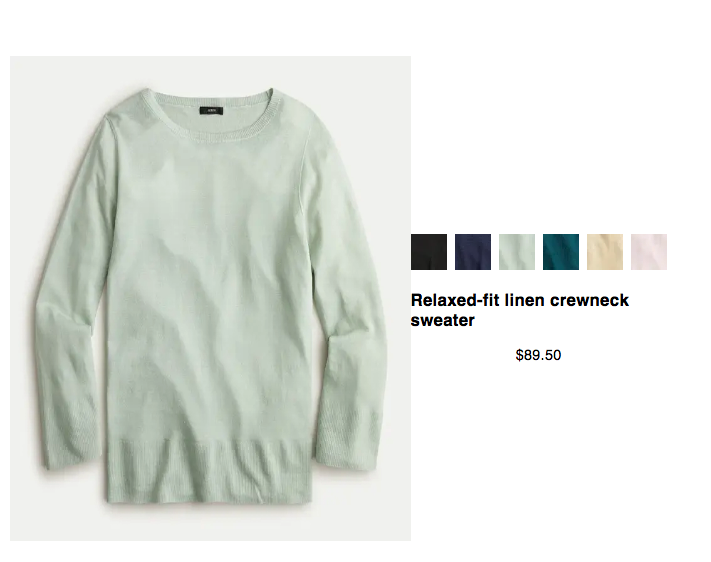

# J.Crew Application

## Table of Contents

1.  [General Info](#general-info)
2.  [Technologies](#technologies)
3.  [Getting Started](#Getting-Started)

### General Info

---

This application is an simplified version of the category and product page at J.Crew.

Category Page

Product page

Note: Multiple swatches will show if the jSon has show-all-colors notated as true. To update this logic please go to `[productCode].js` and take out the ternary operation.

## Technologies

---

- Next.js, React, Redux, Node.js and Javascript.

## Getting-Started

---

**Running Locally**

    - npm install
    - cd into server folder and run Run the Node.js server via node category-server.js 'node category-server.js'
    - npm run dev in main
    - Application will now come up on localhost: 3000
